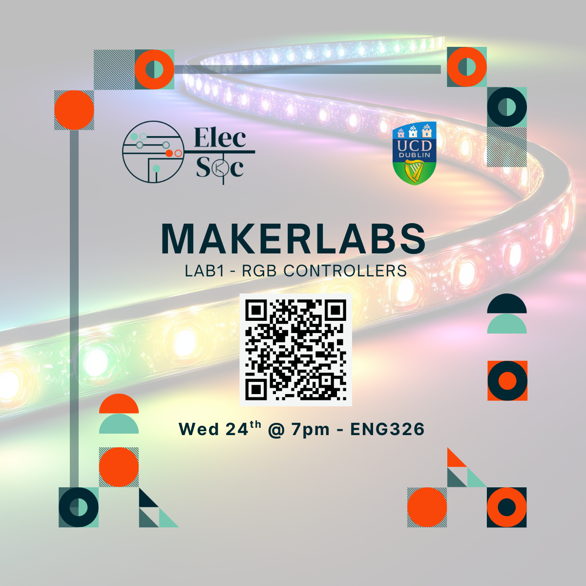

<iframe
  src="https://luma.com/embed/event/evt-9rArTrjfQiNlEcA/simple"
  width="600"
  height="800"
  frameborder="0"
  style="border: 1px solid #bfcbda88; border-radius: 4px;"
  allow="fullscreen; payment"
  aria-hidden="false"
  tabindex="0"
></iframe>  

It's ElecSoc's first MakerLab!

Join [*Joe Biju*](https://www.linkedin.com/in/joebiju456/) as he runs a workshop about how microcontrollers work, with the opportunity to get hands-on with Arduino and build and program you're own circuit - and by the end get a nice cert for your CV :)

But we're going beyond just blinking boring LEDs - you'll be making your own pseudo-RGB LED strip! That's right, we'll be diving into how to use PWM to generate any colour you want and how Arduinos can communicate with each other to make one long chain of cool lights and effects.

For our best performer, they also get a secret prize! 👀

Come for some free pizza and some fun learning, and of course, get a free certificate by the end. All backgrounds and experience levels are welcome :D

----
Sign up below on Luma as there are limited seats!

👉 [Luma Event Registration Link](https://luma.com/6z2osr7w)

----
