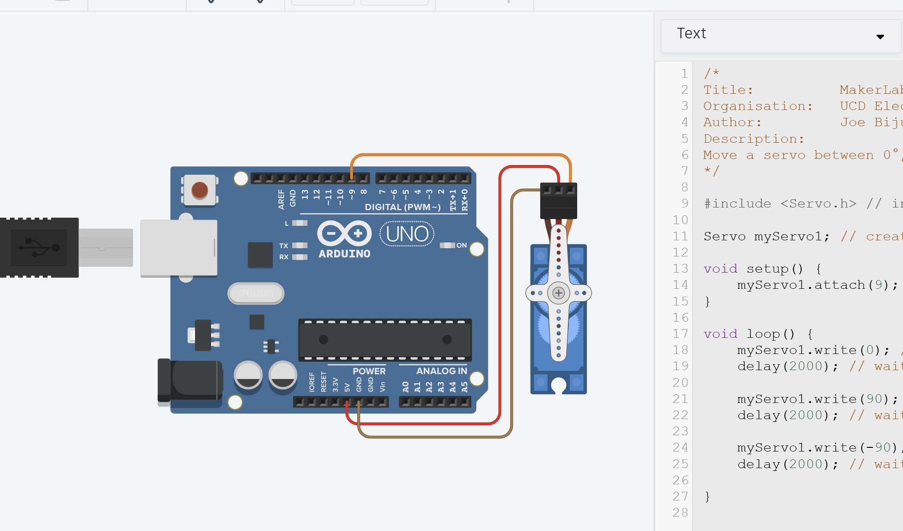

# Challenge0: Servo IRL

---

You're **first challenge**! Challenges are unguided to test your abilities.

Don't worry, you're still allowed to use any resource to help you complete it including:
- Internet Resources
- Generative AI *(make sure to understand it's suggestions! TAs will quiz you 👀)*
- Ask a TA *(though do this after trying the above. Problem-solving is what makes you a good engineer!)*

---

## Objectives
- Using your code and designs from [Task 1](Task1), build the circuit in real life!
- Once you're done and it's working, show a TA.

---

## Equipment
- TinkerCAD account (with design from [Task 1](Task1))
- x1 Arduino Uno 
- x1 Servo (9g or any other)
- x3 Male-to-Male jumper wires

---

## Useful Advice (Hopefully)
- **Arduino IDE 2** is already installed on all the lab PCs *(Note: there are two Ardunio IDEs installed on each PC. Use the newer version.)*
- If you want to install Arduino IDE on your own PC, check out [How to setup Arduino IDE](../Wiki/04_SettingUpArduinoIDE2).
- If you're unsure how to upload a sketch to an Arduino *(how to add libraries, how to select a COM port, etc.)*, check out [How to upload a sketch to Uno](../Wiki/05_UploadingSketchestoArduino).
- Make sure to use the tip from [Task 0](Task0) and upload a simple blinking onboard LED first to check your Arduino works. To save you writing the code, go to `File > Examples > 01.Basics > Blink`

Make sure to try yourself, but of course, **don't spend the whole lab on this!** If you can't get it working in 3-5mins, *please* call a TA to help out. There's so much more fun stuff to do, don't get stuck on this step.

# Media

---

