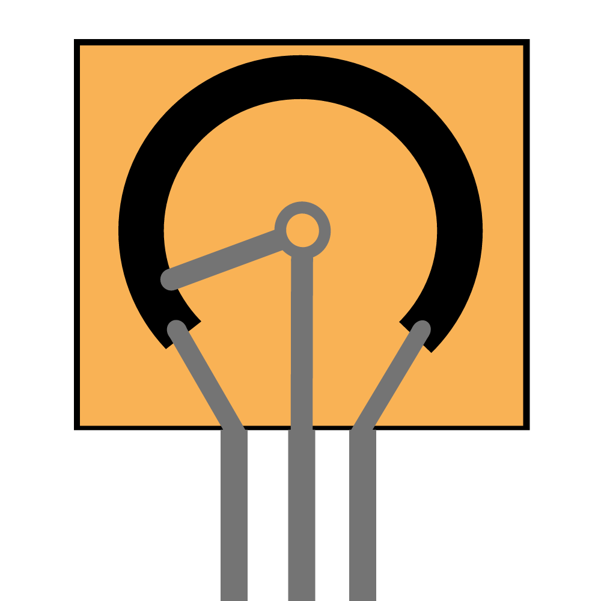

*The Lab Materials will be released soon! (You will receive an email from Luma when ready)*

Until then, check out: [Additional Resources](Resources) for bonus content to get you in the zone :D

----
# Introduction

Welcome to the first MakerLab! In this lab, we'll be
- How microcontrollers can **control DC motors, servos, and more**
- ​Using **PWM** to vary speed and direction
- ​Concepts like **torque, back-EMF, and H-bridges**
- ​How to **wire and safely power** your circuit, as well as **program** simple movements.

By the end, you'll learn everything needed to hit the ground running when working on projects with spinning components 
(especially useful for the robotics sessions!)

----
# Prologue
*insert PowerPoint pdf*

*Illustration of Potentiometer. Created by Robotics Officer [Cian Brady](https://www.cianbrady.ie/)*
----
