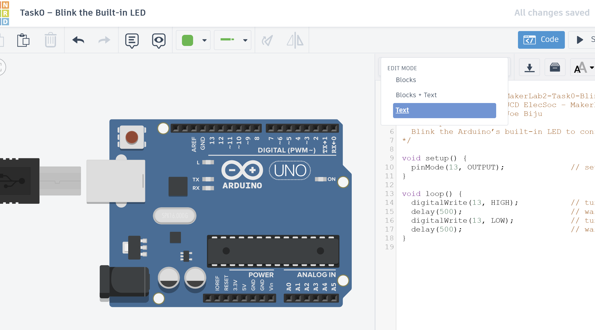
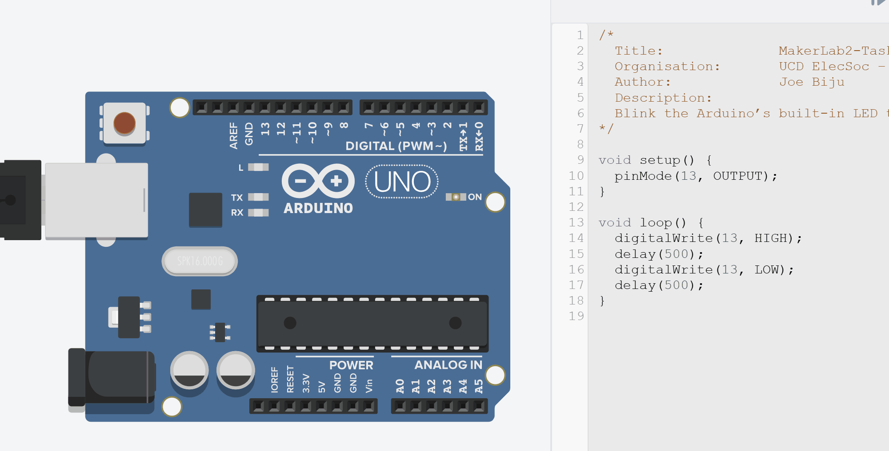

# Task0 – Blink the Built-in LED

{: .tip-title }
> 📝 Task 0  
>
> Blink built-in LED in TinkerCAD

---

## Brief
You’ll use Arduino’s built-in LED to verify your board and code setup, practice basic programming, and get comfortable with the upload/simulation process. Completing this ensures you’re ready for more advanced concepts from MakerLabs and Robotics Sessions


---

## Objectives
- Understand how to toggle a digital output pin
- Learn what `setup()` and `loop()` functions do in an Arduino sketch  
- Verify that your Arduino board and code both function correctly  

---

## Equipment
- **TinkerCAD account** (no hardware required yet)  
- **Arduino Uno (virtual)**  
- No extra components needed  

<!--
<iframe src="https://www.tinkercad.com/things/gMsqdzUguZO-task0-components-only?sharecode=TCbMxVlTe_D6h4BjKyLM9KQCciKhZtBycoSmm1gdZ58"
        width="700"
        height="400"
        frameborder="0"
        allowfullscreen
        style="border: 1px solid #ccc; border-radius: 6px;">
</iframe>
-->

---

## Step 1 – Create a New TinkerCAD Circuit
1. Click this link to join the [TinkerCAD class](https://www.tinkercad.com/joinclass/IEIN5WNGZ) *(if you don't have an account already, create one with your UCD email)*
2. Go into Task0
3. Create a "Create new design"
4. Once your in the editor, drag in an **Arduino Uno R3**.  
5. Click **Code → Text** to switch to text mode.  



---

## Step 2 – Write the Blink Sketch

All Arduino code **must** contain the function `void setup()` and `void loop`, otherwise it will not compile.
This is because Arduino is pre-programmed to look for these functions as they are fundamental to its operation.

Anything in the `void setup()` function is run **once** when the Arduino turns on. It's used to intialise pins, objects, or anything else that's done only once at the start.

After that, anything in the `void loop()` function is run **repeatedly**, *infinitely* and *as fast as possible* (16Mhz for an Arduino Uno!). The rest of your code goes here (though there are exceptions which we'll cover in due course)


Currently, you should have an example sketch. Replace the code with the following


```cpp
/*
  Title:              MakerLab2-Task0-Blink
  Organisation:       UCD ElecSoc – MakerLab
  Author:             Joe Biju
  Description:
  Blink the Arduino’s built-in LED to confirm setup.
*/

void setup() {
  pinMode(13, OUTPUT);              // set the LED pin as output
}

void loop() {
  digitalWrite(13, HIGH);           // turn the LED on
  delay(500);                       // wait 0.5 seconds
  digitalWrite(13, LOW);            // turn the LED off
  delay(500);                       // wait 0.5 seconds
}
```

{: .tip}
  > It's always best practice adding a comment header to the top of your file. 
  > Most importantly, a description of how it works and if there's any quirks with your program
  > 
  > Trust me, when you come back to it after 3 weeks, you won't remember at all how it works and you'll end up studying your own code for hours to regain that revelation 😂

Well before we run it, what does this do?

As we've said, `void setup()` will run once. What the [`pinMode()`](https://docs.arduino.cc/language-reference/en/functions/digital-io/pinMode/) function will do is enable `pin 13` and setting it to `OUTPUT`. So now the Arduino knows that this pin is available to control.

Next, `void loop()` will repeatedly run the code inside it. There we have [`digitalWrite()`](https://docs.arduino.cc/language-reference/en/functions/digital-io/digitalwrite/), which sets the output to either HIGH (aka 5V) or LOW (aka 0V). `delay()` will then wait the specified milliseconds.

So the code simply cycles `pin 13` between HIGH and LOW.

The beauty is that `pin 13` is connected to the onboard LED. Hence, this is a great way to **check you Arduino is working!**

{: .extra}
> For those with experience in code, you may be wondering where the functions `void setup()`, `void loop`, `pinMode()`, etc are defined.
>
> In fact, when you hit Upload/Run Simulation, Arduino IDE/TinkerCAD will secretly add to the very top of the script `#include <Arduino.h>` which is a library that contains all these definitions and more (more preceisely, the compiler adds them)
>
> Thus, though it seems the Arduino is pre-programmed with these functions, actually everytime you Upload code, you're uploading all these default functions. You can absoolutely mess around with the `<Arduino.h>` library if you wanted and change the default definitions.
>
> We won't tho :)

---

## Step 3 – Run
Press **Start Simulation** in TinkerCAD.  
You should see the small LED on the Arduino board blink on and off twice per second.  



{: .troubleshooting }
> If it doesn’t work:
- Make sure you didn’t rename or remove the `setup()` or `loop()` functions.  
- Confirm you used `pin 13` and included in `setup()` that it's an output.  
- Check for missing semicolons - you won't believe the insane error warnings for a simple `;`  


<!-- The built-in LED on most Arduinos is connected to **digital pin 13**,  so `LED_BUILTIN` and `13` behave identically.
{: .tip} -->
---

## Step 4 – Modify and Explore
Replace `13` with `LED_BUILTIN`. Why does nothing change?  
{: .try}

{: .tip }
  > Before doing *any* programming, start by double-checking your physical Arduino **actually works** and is not fried.
  >
  > Use this function with `LED_BUILTIN` (Pin 13 on Arduino UNO) to test uploading and executing code.
  >
  > You can get the code quickly in Arduino IDE by going `File > Examples > 01.Basics > Blink`

You’re already controlling time and digital states - exactly what you’ll need for servos and sensors in the next task.