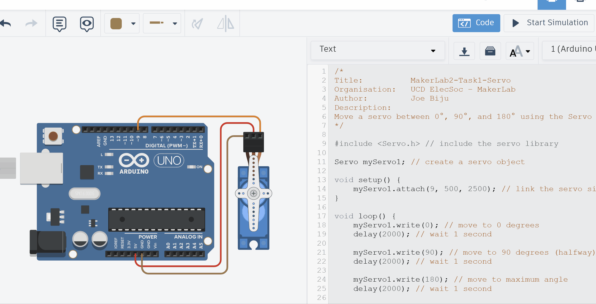

# Task1 – Servo Pre-Moves

{: .tip-title }
> 📝 Task 1  
>
> In TinkerCAD, program default moves for a servo (0º, 90º, 180º, 0º, …)

---

## Brief

In this task, you’ll move a servo motor in **TinkerCAD** through a simple pattern:  
0°, 90°, 180°, then back to 0°, repeating endlessly.  

This introduces the **Servo library** and how **PWM** signals translate to angle control.

---

## Objectives
- Learn how to include and use the Arduino **`<Servo.h>`** library  
- Understand how servo signals correspond to movement  
- Create a repeatable motion pattern  

---

## Equipment
- TinkerCAD account  
- x1 Arduino Uno (virtual)  
- x1 Servo (9g or similar) 

---

## Step 1 – Set Up the Circuit
1. In TinkerCAD → Circuits, create a new project.  
2. Add an **Arduino Uno R3** and a **servo motor**.  
3. Wire the servo:  
   - **Signal** (yellow/orange) → pin 9  
   - **VCC** (red) → 5 V  
   - **GND** (black/brown) → GND  
4. Open *Code → Text* to switch to text mode.  


---

## Step 2 – Write the Program

Copy the following code into your TinkerCAD program.
```cpp
/*
Title:          MakerLab2-Task1-Servo
Organisation:   UCD ElecSoc – MakerLab
Author:         Joe Biju
Description:
Move a servo between 0°, 90°, and 180° using the Servo library.
*/

#include <Servo.h>                  //Include the servo library

Servo myServo1;                     //Create a servo object

void setup() {
    myServo1.attach(9, 500, 2500);  //Link the servo signal to pin 9
}

void loop() {
    myServo1.write(0);              //Move to 0 degrees
    delay(2000);                    //Wait 2 second

    myServo1.write(90);             //Move to 90 degrees
    delay(2000);                    //Wait 2 second

    myServo1.write(180);            //Move to maximum angle
    delay(5000);                    //Wait 5 second

}
```

Now, what's going on?

### Library
Firstly, we have now included **our first library** by `#include <Servo.h>`. It contains all the necessary functions to create a PWM signal and map an angle from 0-180º to a digital pin of the user's choice.

This saves us from having to code everything ourselves. If you ever want to know more about the functions inside a library, look it up online. If you want to refresh how servos and PWM work, refer to the [Prologue](Intro)

{: .tip}
Most of the time, there's a high likelihood someone has done what you want and put it online for free. Reuse, reduce, recycle ladies and gentlemen!

### Objects
We then created an **object**. 

You can imagine an object `myServo1` as a copy of a template from `Servo` containing a list of sections such as pin, angle, speed, etc. but no values defined (though some can have default values). The sections and values depends on how the developer who created the library.

{: .extra}
> Object-Orientated Programming (OOP) is an advanced programming concept. The idea of creating *classes* that *objects* can inherit, whilst also being able to edit the values inside each object as well as call functions attached to that specific object - extremely useful in programming. It's actually one of the biggest reasons for the development and usage of the C++ language over plain C.
>
> I unfortunately do not have the bandwidth to teach this topic, and for the average hobbyist, the idea I stated above of copying a template we can edit is sufficient.

### Using `<Servo.h>` library
Once our copy is made, we can then start filling in the empty sections!

Firstly, we state the servo is connected to `pin 9`, and the 0º = 500us, and 180º = 2500us. We can achieve all of this by calling `myServo1.attach(9, 500, 2500)`.

{: .think}
On an Arduino Uno, we only use `pins 3`, `5`, `6`, `9`, `10` and `11` for controlling Servos or other PWM devices. Why?

{: .tip}
If you don't remember why we need to define what zero and 180 degrees is in code, refer to the [Prologue](Introduction)

After declaring the settings of the servo, we can now move it. We tell the servo to go to 0º by `myServo1.write(0)`.

By adding delays and setting more angles, we can create a pattern!

{: .warning}
> Servos are physical components! Programming angles that are impossible for it to reach can cause damage if you don't know what you are doing (speaking from experience unfortunately).

{: .warning}
> Servos need *time* to move. If you do not provide enough of a delay before giving the next angle, the servo will never actually reach the desired target! *(try changing the delay of the previous code to 500ms and see if the servo still moves correctly)*

---

## Step 3 – Run
Click **Start Simulation**.  
The servo horn should sweep to 0°, then 90°, then 180°, and then back to 0° after an extra delay. It then repeats the pattern.  



{: .troubleshooting }
> If it doesn’t move:  
> - Check your wiring - only use pins that support PWM (has little `~` symbol beside number)
> - Ensure your code logic is correct and you use consistent naming.
> - Check if you have given enough time between angles for the servo to actually move
> - Give it a moment - TinkerCAD’s simulation can lag slightly.  

---

## Step 4 – Modify and Explore
Try some quick changes such as altering the delay or angles to see how the servo responds.

{: .try}
Try set an angle beyond 180º. What happens? Can you guess why?

{: .try}
Try set a *negative* angle. What happens? Is it the same reason as going beyond 180º?

{: .think}
> Try renaming the object to whatever you want. Maybe...
> ```cpp
> Servo leftArm;
> ```
> and edit the rest of the code appropriately (e.g. it would be `leftArm.attach(9)` now). Notice that it still works.
>
> Objects can have whatever name you want!

<!-- {: .challenge-title}
> 💪 Challenge 1  
> - Change the delay times to speed up or slow down the motion.  
> - Reverse the order (180 → 90 → 0) to test direction.  
> - Add intermediate angles like 45° and 135°.  
> - Use `Serial.println(angle);` to print each angle to the Serial Monitor.   -->

You’ve just created a programmed **motion loop** - extremely valuable in automation industry! 

Consider a pick-and-place machine or similar.  


