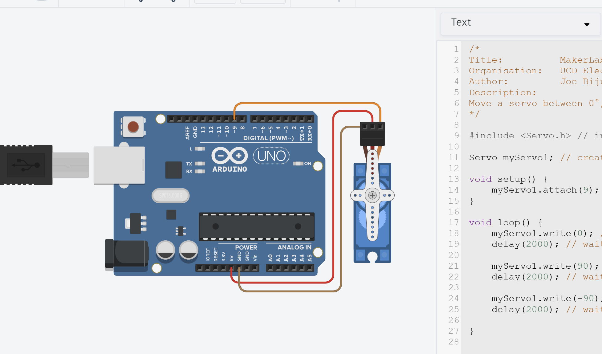
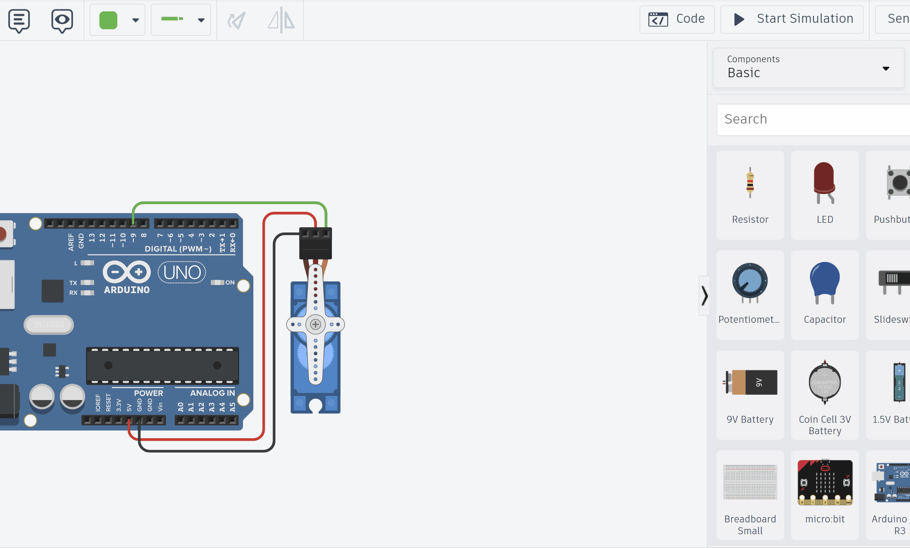

# Task3 – Debugging with Serial Monitor

{: .tip-title }
> 📝 Task 3  
>
> In TinkerCAD, use the Serial Monitor to display messages when the servo moves to each angle.

---

## Brief

You’ve now seen how functions simplify your servo code - but when programs grow larger, it’s easy to lose track of what’s happening when. 

That’s where **Serial Monitor debugging** comes in.

Using the Serial Monitor in Arduino IDE or TinkerCAD, you can **print messages to the screen** showing what your code is doing in real time. This is essential for troubleshooting and understanding your program’s flow.

---

## Objectives
- Learn how to use the `Serial` library to display information  
- Understand when to use debug prints

---

## Equipment
- TinkerCAD account  
- x1 Arduino Uno (virtual)  
- x1 Servo (9g or similar)

---

## Step 1 – Continue from Previous Task
You can continue using the same TinkerCAD design and code from [Task 2](Task2). 



---

## Step 2 – Programming Serial Communication

### Setting up and using `Serial` library

The `Serial` library and function are built into Arduino, similar to how `pinMode()` etc. is.

The Serial library handles **UART** communications between devices. In our case, the Arduino and the PC.

{: .extra}
> The `Serial` library is automatically included for Arduino Uno *just* for communicating between Arduino and PC. There may be times you want to talk to other peripherals via the digital pins. 
> 
> In that case, you might use `Hardware Serial` or `Software Serial` and create multiple ports. We will not cover it in labs.

Before using the Serial Monitor, we must **initialise serial communication** inside `setup()`.

Insert the following line at the start of your `setup()`:

```cpp
Serial.begin(9600); // Start serial communication at 9600 baud
```

This tells the Arduino to open up a COM port with the PC/TinkerCAD and begin communicating at a baud rate of 9600.

{: .extra}
> There are **many baud rates** you can use. Commonly you will find online either 9600 or 115200. It just some standard speeds for transmitting information developed over the years. More standards were released as more powerful computers with higher clock cyles were built.
>
> Higher speed just means faster communication. There are risks of more errors technically *(though pretty much zero chance of errors when using USB of Arduino, more common in wireless Serial Monitors)*, however, most protocols have error correction. If you're interested, read about the **OSI Model** and **Physical Layer** in communication systems *(you will learn this if you take EEEN20060)*
>
> For hobby electroncics, feel free to use whatever you want. Just make sure the Arduino and PC both are set to the **same baud** rate!

### Use `Serial` library functions
Then, you can use either `Serial.print()` or `Serial.println()`.

```cpp
Serial.print("Hello ");
Serial.print("World!\n");
Serial.print("I love MakerLabs :D");
```
Which will output the following
```
Hello World!
I love MakerLabs :D
```
Notice how `.print()` function prints on the same line as before. So to go to the next line, we add the `\n` character.

This gets tiring though, so we can use the `.println()` function that automatically inserts the `\n` character. So we can rewrite as
```cpp
Serial.print("Hello ");
Serial.println("World!");
Serial.print("I love MakerLabs :D");
```

{: .extra}
There are many other functions in `Serial` library, including those that read as well as write. See [Arduino Docs](https://docs.arduino.cc/language-reference/en/functions/communication/serial/) for more info

### Modify `setServoAngle` function

We’ll now modify the `setServoAngle()` function from [Task 2](Task2) to include Serial output.

```cpp
/*
    Function that takes in servo angle and delay and moves servo to target
*/
void setServoAngle(int targetAngle, int delayTime = 2000) {
    // Print the target angle to Serial Monitor
    Serial.print("Moving servo to angle: ");
    Serial.println(targetAngle);  

    myServo1.write(targetAngle);
    delay(delayTime);

    return;
}
```

### Full Code
```cpp
/*
Title:          MakerLab2-Task3-Debugging
Organisation:   UCD ElecSoc – MakerLab
Author:         Joe Biju
Description:
Add Serial Monitor debugging messages to track servo movement.
*/

#include <Servo.h> // include the servo library

Servo myServo1; // create a servo object

void setServoAngle(int targetAngle, int delayTime = 2000) {
    // Print the target angle to Serial Monitor
    Serial.print("Moving servo to angle: ");
    Serial.println(targetAngle);
    
    myServo1.write(targetAngle);
    delay(delayTime);
}

void setup() {
    Serial.begin(9600); // Start serial communication
    myServo1.attach(9, 500, 2500);  //Link the servo signal to pin 9
    Serial.println("Setup complete. Beginning servo test...");
}

void loop() {
    setServoAngle(0);
    setServoAngle(90);
    setServoAngle(180, 5000);
}
```

---

## Step 3 - Run

In TinkerCAD:
- Click **“Code”** on the top right to open the code panel if not already.
- Click **“Serial Monitor”** at the bottom right corner.  
- Press **Start Simulation**.

You should have the same physical result as [Task 1](Task1), only now you can open the Serial Monitor to view messages!




{: .troubleshooting }
> - Check that the **baud rate** in Serial Monitor matches `Serial.begin(9600)`.  
> - If nothing prints, ensure `Serial.begin()` is in your `setup()` and **not** inside a loop.  
> - Avoid flooding the Serial Monitor with too many prints inside `loop()` - it can lag the simulation.

---

## Step 4 – Modify and Explore
Try adding more messages to help debug. Maybe print both the angle and delay values:
```cpp
Serial.print("Angle: "); Serial.print(targetAngle);
Serial.print(" | Delay: "); Serial.println(delayTime);
```

You’ll quickly see how easy it becomes to track what’s happening in your code - especially as it grows in complexity.

If you **don't want** to print a message, simply comment it out by insert `//` at the start of the line (or the shortcut `CTRL + /`)

{: .tip }
> The Serial Monitor is your best friend when things *don’t* work.
> - Use it to check whether your code reaches certain lines.  
> - Print sensor values, timing information, or error flags.  
> - Delete or comment them out later once your program runs perfectly.

{: .think }
> Every great engineer spends as much time verifying their code as writing it.

{: .tip-title }
> 🚀 PRO-Tip!
> 
> **Using `#define DEBUG` for Quick Toggles**  
>
> Another super cool (but totatlly optional!) trick for switching Serial messages on and off without deleting them is to add this at the top of your sketch:  
>
> ```cpp
> #define DEBUG if(true)
> //#define DEBUG
> ```
>
> Now, whenever you want a debug print, just write it like this:  
>
> ```cpp
> DEBUG Serial.println("Hello world!");
> ```
>
> To quickly disable all debug output messages, simply comment out the first `#define` line and uncomment the second one - now nothing prints.
>   
> ```cpp
> //#define DEBUG if(true)
> #define DEBUG
> ```
>
> It's beyond the scope of the labs to explain how it works, but if you’re curious, ask a TA (Hint: **Pre-processor directives**).

