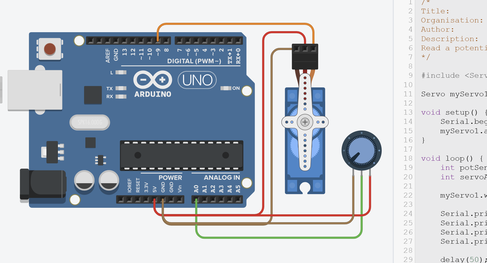
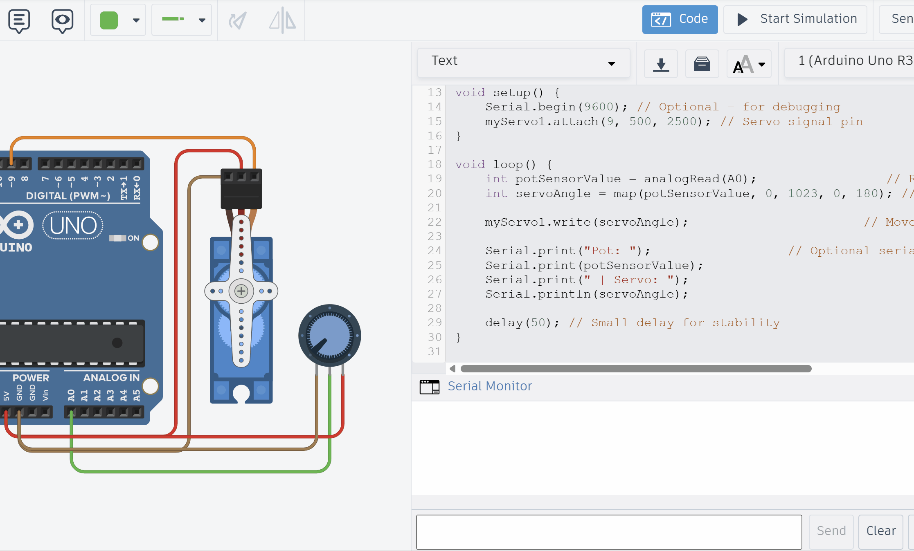

# Task4 – Potentiometer

{: .tip-title }
> 📝 Task 4  
>
> In TinkerCAD, program the servo to read a potentiometer and set the angle accordingly.

---

## Brief

Until now, we’ve been giving the servo *fixed* angles in code.  

That’s cool, but real-world devices - joysticks, dials, sensors - send **variable inputs** that continuously change.

In this task, you’ll use a **potentiometer** (a variable resistor) as an **analog input** to control the servo’s angle in real time.  

Spin the knob → servo moves. Simple as that.

---

## Objectives
- Learn to read analog values with `analogRead()`  
- Map sensor readings to servo movement  

---

## Equipment
- TinkerCAD account  
- x1 Arduino Uno (virtual)  
- x1 Servo (9g or similar)  
- x1 Potentiometer  

---

## Step 1 – Circuit Setup

Reuse your design from [Task 1](Task1).  

Add a potentiometer and wire it so:
- **Left pin → GND**
- **Middle pin → A0**
- **Right pin → 5V (VCC)**



{: .tip }
> Unlike digital I/O pins (D0–D13), analog pins (A0–A5) can only take inputs.  
> Their advantage is that they include a built-in **Analogue-to-Digital Converter (ADC)**, meaning they can sense voltages from 0–5 V and return a corresponding digital value from 0–1023 - kind of like a mini-multimeter inside the chip!

---

## Step 2 – Programming the Servo with Potentiometer

### Understanding `analogRead()`

The potentiometer acts as a voltage divider: as you turn the knob, the voltage on the middle pin varies smoothly from 0V to 5V.  

```cpp
int potSensorValue = analogRead(A0);
```  

The Arduino’s **10-bit Analog-to-Digital Convertor (ADC)** converts that voltage into a number between **0 and 1023**:  
- 0 → 0 V (knob fully counter-clockwise)  
- 512 → ≈ 2.5 V (middle position)  
- 1023 → 5 V (fully clockwise)  

Each step represents about 4.9mV (5V / 1023 ≈ 0.0049V).

{: .extra }
> **About the AREF Pin**  
>
> The **AREF (Analog Reference)** pin on the Arduino lets you change what voltage corresponds to the maximum `analogRead()` value of **1023**. By default, the reference is the board’s 5 V supply, meaning `0V → 0` and `5V → 1023`.  
> 
> However, you can improve accuracy for lower-voltage sensors by providing your own precise reference (for example, 3.3 V or 1.1 V) to the AREF pin and calling  
> ```cpp
> analogReference(EXTERNAL);
> ```  
> **NEVER** connect anything to AREF without setting `analogReference(EXTERNAL)` first -otherwise, you could short the internal reference.

---

### Mapping the Analog Input to Servo Range

The `<Servo.h>` library expects an **angle between 0° and 180°**, not a raw sensor value.  
To link these scales, Arduino provides the `map()` function, which rescales one range to another:

```cpp
map(value, fromLow, fromHigh, toLow, toHigh);
```

We can use it like this:

```cpp
int servoAngle = map(potSensorValue, 0, 1023, 0, 180);
```

Now:
- when the knob is at 0 V → servoAngle = 0°  
- halfway → ≈ 90°  
- at 5 V → 180°  

{: .extra }
> You can also get the actual voltage if you like:
> ```cpp
> float voltage = potSensorValue * (5.0 / 1023.0);
> ```
> But we’ll just use the raw integer for now.

---

### Writing the Values to the Servo

Once we have our mapped angle, we can send it to the servo and (optionally) print the readings to the Serial Monitor:

```cpp
myServo1.write(servoAngle);

Serial.print("Pot: ");
Serial.print(potSensorValue);
Serial.print(" | Angle: ");
Serial.println(servoAngle);
```


### Full Code

```cpp
/*
Title:          MakerLab2-Task4-Potentiometer
Organisation:   UCD ElecSoc – MakerLab
Author:         Joe Biju
Description:
Read a potentiometer and set servo angle based on the input.
*/

#include <Servo.h>

Servo myServo1; // create servo object

void setup() {
    Serial.begin(9600); // Optional – for debugging
    myServo1.attach(9, 500, 2500); // Servo signal pin
}

void loop() {
    int potSensorValue = analogRead(A0);                   // Read potentiometer (0–1023)
    int servoAngle = map(potSensorValue, 0, 1023, 0, 180); // Convert range
    
    myServo1.write(servoAngle);                         // Move servo to mapped angle
    
    Serial.print("Pot: ");                    // Optional serial output
    Serial.print(potSensorValue);
    Serial.print(" | Angle: ");
    Serial.println(servoAngle);
    
    delay(50); // Small delay for smoother movement
}
```

---
## Step 3 - Run

Copy the code and run it on TinkerCAD.

Open the Serial Monitor to see the debug statements.



---

## Step 4 – Modify and Explore
Try changing parameters such as for the `map()` function and see what new behaviours you can create.

{: .try}
Set the delay to 10ms. Set it to 100ms. How does the responsiveness of the servo change?


