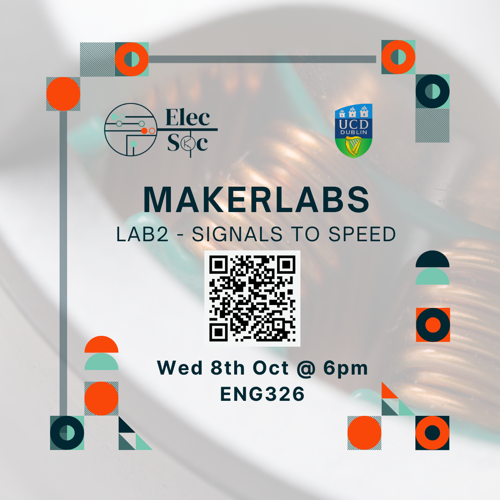

<iframe
  src="https://luma.com/embed/event/evt-kiGwx9BZgxt5TVK/simple"
  width="600"
  height="800"
  frameborder="0"
  style="border: 1px solid #bfcbda88; border-radius: 4px;"
  allow="fullscreen; payment"
  aria-hidden="false"
  tabindex="0"
></iframe>

Join Joe Biju for our second MakerLab - this time diving into the world of motor controllers and electromechanical motion. Whether you're curious about how robots move, how PWM controls speed, or what makes a servo tick, this hands-on session is for you!

We’ll explore:
- How microcontrollers can control DC motors, servos, and more
- Using PWM to vary speed and direction
- Concepts like torque, back-EMF, and H-bridges
- How to wire and safely power your circuit, as well as program simple movements.

This session builds on the basics - but beginners are still absolutely welcome. By the end, you'll have built your own working motor driver circuit and earned a free certificate for your CV!

And of course... there’s a secret prize for the top performer 👀

Come along for some fun, practical learning - no prior experience needed!

----
Sign up below on Luma as there are limited seats!

👉 [Luma Event Registration Link](https://luma.com/laylmhi7)

----
