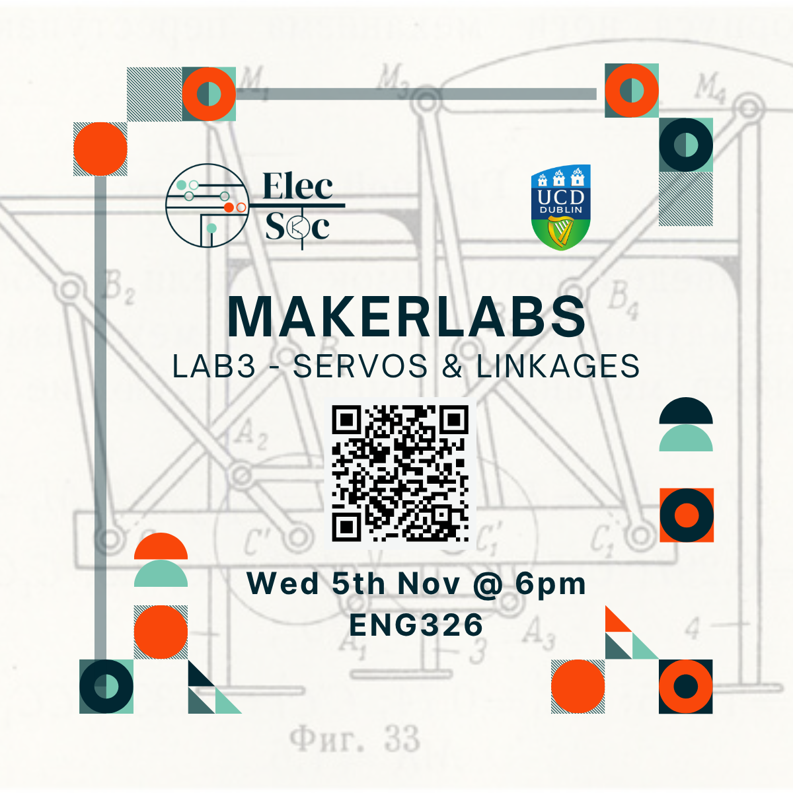

<iframe
  src="https://luma.com/embed/event/evt-dy0jS0WqIbtgGAm/simple"
  width="600"
  height="800"
  frameborder="0"
  style="border: 1px solid #bfcbda88; border-radius: 4px;"
  allow="fullscreen; payment"
  aria-hidden="false"
  tabindex="0"
></iframe>

# MakerLab3 - Serovs & Linkages
Join [*Liam O'Sullivan*](https://www.linkedin.com/in/liam-osullivan-/) and [*Joe Biju*](https://www.linkedin.com/in/joebiju456/) for our third MakerLab - tthis time we’re bringing together the RGB LEDs from Lab 1 and the servos from Lab 2. Whether you missed an earlier session and want to catch up, or you’ve already been to the first two labs and crave a tougher challenge, this hands-on workshop has something for everyone!

This lab will explore:
- **Driving RGB LEDs** with microcontrollers: PWM for smooth colour mixing and timed light effects
- More **advanced Servo mechanisms**: angle mapping, speed control, and chaining multiple servos
- **Mechanical linkages and robotic arms**: simple linkages, mounting servos, and basic kinematics
- **Interfacing an LCD screen** to show simple menus

This session builds on the basics - but beginners are absolutely welcome. If you’re catching up, there will be guided stations covering RGB wiring and single-servo control. For confident builders, we’ve prepared multiple challenges, including assembling a 2 degrees of freedom robotic arm. By the end, you’ll have a working prototype and earn a MakerLab certificate for your CV!

And as always, there’s a secret prize for the top performer 👀

Come tinker, learn, and link things together - no prior experience required!

----

*(Note: You must be a member of ElecSoc to participate. If you are not already signed up, you can sign up on arrival. Card payment is accepted.)*

----
Sign up below on Luma as there are limited seats!

👉 [Luma Event Registration Link](https://luma.com/nnap69gf)

----
