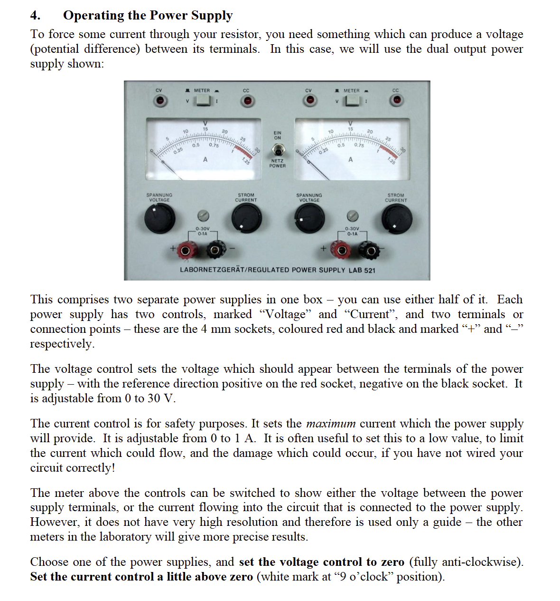

*A full tutorial on using a power supply will be released soon. The following is a copy of the lab instructions from EEEN20020. All rights reserved.*

*File: EEEN20020 AUT24 - Lab1_rev2*
----
*Module: EEEN20020*
