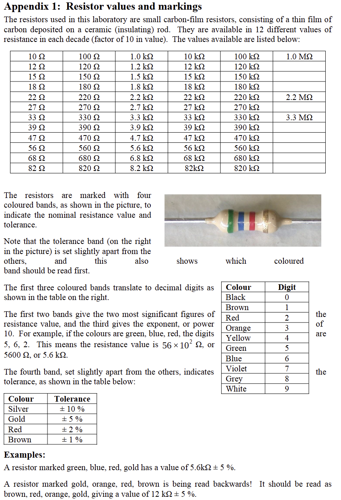

*A full tutorial on using a reading resistor bands, choosing the correct resistor, and how resistors affect circuits will be released soon. The following is a copy of the lab instructions from EEEN20020. All rights reserved.*

*You may also consider using a "Resistor Band Calculator" such as [this one](https://www.digikey.ie/en/resources/conversion-calculators/conversion-calculator-resistor-color-code) from DigiKey. (We are not affiliated, I just like the UI.)*

*File: EEEN20020 AUT24 - Lab1_rev2*
----
*Module: EEEN20020*
