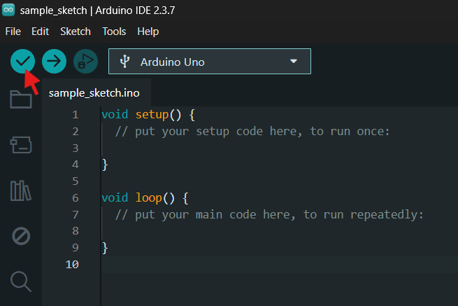
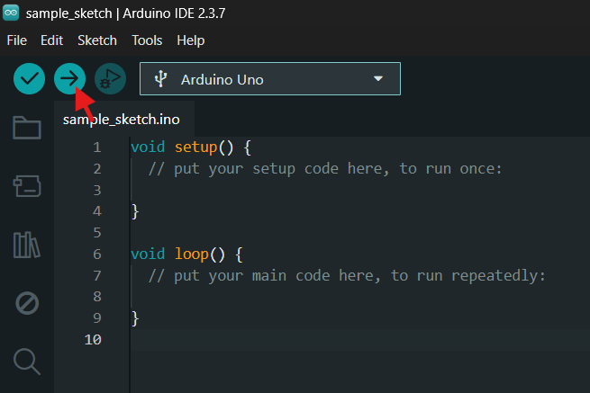

# Arduino IDE
Arduino is an open-source electronics platform based on easy-to-use hardware and software. It is widely used for learning, prototyping, and building electronic projects.

Arduino IDE is the software used to write, compile, and upload code (called sketches) to Arduino boards. It uses a simplified version of C/C++.

# Setting up Arduino IDE

*A full tutorial with walk-through of installing and setting up Arduino IDE, as well as best practices, will be released soon. Please refer to [docs.arduino.cc](https://docs.arduino.cc/) for general Arduino help*

*Downloading and installing the Arduino IDE 2*
----
*Website: docs.arduino.cc*

[https://docs.arduino.cc/software/ide-v2/tutorials/getting-started/ide-v2-downloading-and-installing](https://docs.arduino.cc/software/ide-v2/tutorials/getting-started/ide-v2-downloading-and-installing/)

# Using Arduino IDE

## Uploading a sketch
Sends your sketch to the Arduino pluged into your computer.

## Verifying a sketch
Checks your sketch for any coding errors.
