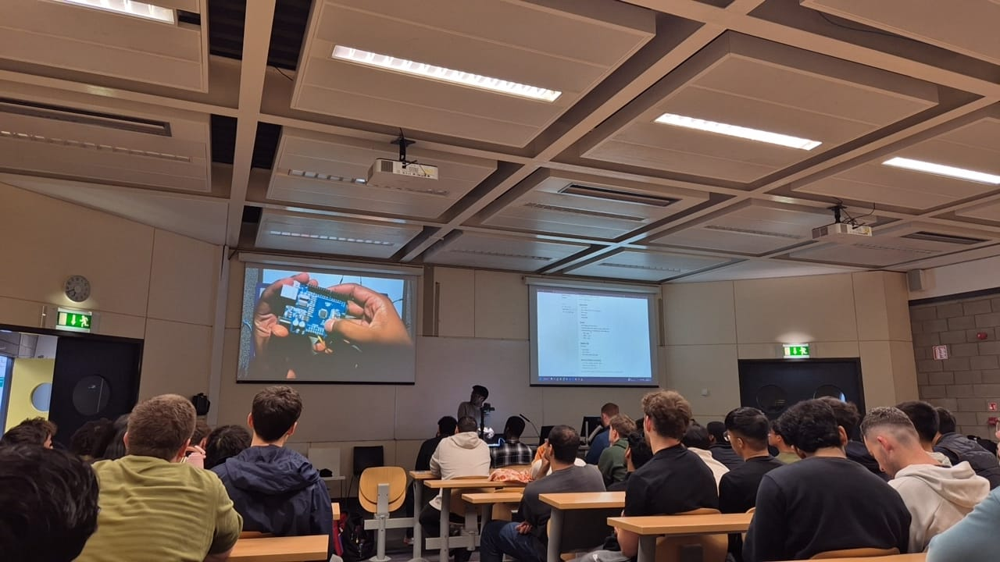

ElecSoc has one mission: 
> *"Inspire people to bring crazy ideas to life."*

So in 2025, we launched "**MakerLabs**" led by [Joe Biju](https://www.linkedin.com/in/joebiju456/). 

Twice a month, we invite students from *all backgrounds* to come learn the hard and soft skills needed in engineering. From 
- microcontrollers to motors, 
- soldering to 3d printing, 
- programming to digital design, 
- and more!

We want to show people what elec engineering is about 🦾

The kicker? We provide all the space and funding needed for our members to make learning accessible to all. 

And of course, they get a nice cert in the end 😁
